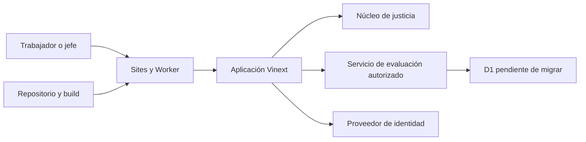

# Modelo de amenazas — Estrellas del Equipo

## Executive summary

El mayor riesgo no es técnico sino de integridad: una cuenta comprometida, un rol administrativo controlado en el navegador, evaluaciones manipuladas o una regla retroactiva podrían afectar reputación, aprendizaje y dinero de un equipo pequeño. El reparto tiene siete participantes, seis evaluadores y cinco sujetos evaluados. Antes del uso real se requieren cuentas individuales, control de acceso en servidor, auditoría, protección de identidades y reglas versionadas.

## Scope and assumptions

- En alcance: `app/`, `domain/`, `db/`, `worker/`, `.openai/hosting.json`, configuración de build y pruebas.
- Uso confirmado: 7 participantes del reparto —jefe, barman, cuatro garzones y cajera— con cuentas individuales.
- Datos sensibles: identidad, evaluaciones, comentarios, conocimientos, errores, recompensas y planes de mejora.
- Exposición: aplicación web alojada en Sites y accesible por Internet solo a usuarios autorizados.
- Se asume un local y una organización durante la primera versión.
- Existe un acuerdo de 4,65 puntos de experiencia: 1,00/1,00/0,65/0,50/0,25/0,75/0,50.
- El jefe no evalúa ni es evaluado; la cajera evalúa, no es evaluada y conserva un factor fijo de 0,50 puntos.
- Fuera de alcance actual: POS, asistencia, cocina, pagos, nómina y despliegue productivo de D1.

Preguntas residuales:

- ¿El primer lanzamiento corresponde efectivamente a un solo local?
- ¿Las contraseñas se administrarán en la aplicación o mediante un proveedor de identidad?
- ¿Desde cuándo rige la tabla de 4,65 puntos de experiencia y con qué frecuencia puede revisarse?

## System model

### Primary components

- **Cliente web:** interfaz React con datos de demostración y estado local (`app/page.tsx`).
- **Identidad y autorización de escritura:** lectura estricta del sujeto autenticado, vínculo único a usuario, membresía activa y aislamiento organizacional (`domain/identity.ts`, `domain/access-control.ts`, `server/evaluation-service.ts`).
- **Núcleo de justicia:** elegibilidad, agregación robusta y clasificación sin consecuencias automáticas (`domain/fairness.ts`).
- **Worker:** entrada HTTP, endpoint de evaluaciones, binding D1 y optimización de imágenes; delega las páginas a Vinext (`worker/index.ts`).
- **Persistencia:** adaptador y binding D1 declarados, esquema de 17 tablas y seis migraciones generadas; todavía no se aplican a una instancia (`db/index.ts`, `db/schema.ts`, `.openai/hosting.json`, `drizzle/`).
- **Build y pruebas:** Vite/Vinext, scripts de validación y pruebas Node (`package.json`, `scripts/`, `tests/`).

### Data flows and trust boundaries

- Internet → Sites/Worker: solicitudes HTTP y sesión; TLS pertenece a la plataforma. El endpoint de evaluaciones aplica autenticación, origen y autorización, pero aún no tiene rate limiting propio.
- Worker → servicio: el endpoint exige origen idéntico, sujeto autenticado estable y autorización derivada de D1; `app/page.tsx` aún no lo consume.
- Navegador → estado React: rol, estrellas, “No observado” y navegación; todo es modificable por el usuario y no es una frontera de seguridad. La API vuelve a validar cobertura, estados y valores.
- Aplicación → D1: el contrato de evaluaciones, reglas, resultados y auditoría existe en el esquema, pero todavía no hay API ni instancia migrada.
- Administrador → decisiones: reglas, recompensas, exportaciones y revisiones siguen siendo elementos visuales sin persistencia; el endpoint implementado solo acepta evaluaciones de pares elegibles.
- Build → artefacto Sites: código y configuración de hosting; la integridad depende del repositorio y pipeline de despliegue.

#### Diagram

## Assets and security objectives

| Asset | Why it matters | Security objective (C/I/A) |
|---|---|---|
| Credenciales y sesiones | Permiten actuar como trabajador o jefe | C/I/A |
| Roles y membresías | Definen quién puede ver o decidir | I/A |
| Relación evaluador-evaluado | Su exposición permite represalia e inferencia | C/I |
| Puntajes y comentarios | Afectan reputación y decisiones | C/I/A |
| Carta y resultados de conocimiento | Evidencian preparación y aprendizaje | I/A |
| Reglas y versiones | Determinan cómo se calcula y explica | I/A |
| Candidaturas y recompensas | Pueden afectar beneficios y propinas | C/I/A |
| Planes de mejora | Contienen información laboral sensible | C/I/A |
| Auditoría | Permite demostrar quién cambió qué y por qué | I/A |
| Artefacto desplegado | Controla toda la experiencia y lógica | I/A |

## Attacker model

### Capabilities

- Usuario externo que prueba contraseñas reutilizadas o robadas.
- Trabajador autenticado que modifica requests, intenta ver datos de otros o coordina evaluaciones.
- Jefe o administrador que abusa de acceso legítimo, cambia reglas o exporta información.
- Persona con acceso temporal a un teléfono desbloqueado.
- Atacante de cadena de suministro con acceso al repositorio o dependencias.

### Non-capabilities

- No se asume acceso directo a la infraestructura administrada de Sites o Cloudflare.
- No se asume control del dispositivo del servidor ni claves de plataforma.
- Hoy no existen evaluaciones persistidas porque D1 no está migrado ni la interfaz consume el endpoint; esa ausencia deja de ser control al activar la operación.

## Entry points and attack surfaces

| Surface | How reached | Trust boundary | Notes | Evidence |
|---|---|---|---|---|
| Ruta raíz | HTTP público/autorizado | Internet → Worker | Renderiza toda la aplicación | `worker/index.ts` / `fetch`, `app/page.tsx` / `Home` |
| Selector de rol | Botones del navegador | Usuario → cliente | Concede vista admin solo visual, sin seguridad | `app/page.tsx` / `changeRole` |
| Headers de identidad | Request de Sites | Plataforma → app | Helper disponible, no usado por la página | `app/chatgpt-auth.ts` / `getChatGPTUser` |
| Envío de estrellas | Eventos de UI | Usuario → estado local | Sin validación servidor ni persistencia | `app/page.tsx` / `setRating` |
| Imagen optimizada | `/_vinext/image` | Internet → Worker/Assets | Anchuras limitadas; transformación delegada | `worker/index.ts` / `handleImageOptimization` |
| D1 pendiente | Endpoint de evaluación creado | Worker → servicio → almacenamiento | Identidad, membresía, turno, participación y duplicados validados; instancia sin migrar | `server/`, `db/schema.ts`, `drizzle/`, `.openai/hosting.json` |
| Build y despliegue | Git y scripts | Desarrollador → producción | Modificación maliciosa compromete reglas | `scripts/build-verified.sh`, `vite.config.ts` |

## Top abuse paths

1. Un trabajador cambia el rol en el navegador → accede a información administrativa cuando esa vista se conecte a datos → descubre resultados o reglas privadas.
2. Un atacante roba una contraseña → entra como trabajador → envía valoraciones y comentarios falsos → altera reputación y candidaturas.
3. Dos trabajadores acuerdan calificaciones máximas recíprocas → superan el umbral → reciben una candidatura injusta.
4. Un usuario repite o modifica requests → crea duplicados o evalúa a alguien con quien no trabajó → domina el resultado.
5. El jefe cambia pesos o umbrales después de ver resultados → favorece o perjudica a una persona → la decisión parece legítima si no hay versiones.
6. Un comentario incluye acusaciones, salud o detalles que identifican al evaluador → llega al evaluado → provoca daño y represalia.
7. Una muestra de tres personas se publica con comentarios y contexto de turno → el evaluado deduce quién opinó → rompe el anonimato práctico.
8. El sistema convierte un puntaje bajo en reducción de propina → aplica una consecuencia sin consentimiento ni procedimiento → genera perjuicio económico y legal.

## Threat model table

| Threat ID | Threat source | Prerequisites | Threat action | Impact | Impacted assets | Existing controls (evidence) | Gaps | Recommended mitigations | Detection ideas | Likelihood | Impact severity | Priority |
|---|---|---|---|---|---|---|---|---|---|---|---|---|
| TM-001 | Trabajador autenticado | Datos reales conectados a la vista actual | Cambia el rol cliente a administrador | Exposición y acciones no autorizadas | Roles, evaluaciones, recompensas | Banner de demo; la escritura deriva identidad, organización y membresía en servidor (`app/page.tsx`, `server/evaluation-service.ts`) | Las vistas administrativas siguen siendo demostrativas y manipulables | Eliminar selector fuera de demo; cargar vistas desde la sesión; checks por acción y objeto | Log de 403 y cambios de rol | High | High | critical |
| TM-002 | Atacante externo | Contraseñas locales débiles o reutilizadas | Credential stuffing y secuestro de cuenta | Evaluaciones falsas y fuga de datos | Credenciales, puntajes | Acceso Sites actual es custom (`.openai/hosting.json`) | No existe flujo de cuenta operativa | Preferir proveedor administrado; si hay alias, hash Argon2id, MFA para jefe, bloqueo gradual, recuperación segura | Alertas por intentos, IP y dispositivo | High | High | critical |
| TM-003 | Pares coludidos | Cuentas válidas y período abierto | Intercambian extremos o represalias | Resultado y recompensa injustos | Puntajes, confianza | Mediana por evaluador y alertas bloquean clasificación (`domain/fairness.ts`) | Sin persistencia ni detector real | Mínimo de 3 evaluadores y 3 turnos; reciprocidad; revisión humana; recompensas por categorías | Métrica de pares recíprocos y correlación | High | High | high |
| TM-004 | Usuario autenticado | API de evaluación futura | Envía autoevaluación, duplicado, otro local o turno | Manipulación del agregado | Observaciones, resultados | Reglas puras verificadas (`domain/fairness.ts`) | No aplicadas en servidor ni DB | Revalidar en transacción; constraints únicos y FKs; idempotency key | Contadores de rechazos por razón | Medium | High | high |
| TM-005 | Administrador interno | Acceso legítimo a configuración | Cambia reglas retroactivamente o ajusta resultados | Favoritismo difícil de probar | Reglas, recompensas, auditoría | Diseño de versiones documentado (`docs/DATA_MODEL.md`) | Sin implementación | Políticas inmutables; vigencia futura; doble aprobación; auditoría append-only | Alerta por cambio cercano al cierre | Medium | High | high |
| TM-006 | Trabajador o jefe | Comentarios libres habilitados | Ingresa PII, insultos o detalles identificadores | Daño, acoso y represalia | Comentarios, identidades | Comentarios aún no persistidos | Sin moderación ni retención | Comentarios estructurados, moderación previa, redacción, acceso mínimo, expiración | Cola de moderación y reportes | Medium | High | high |
| TM-007 | Usuario legítimo | Equipo pequeño y poca muestra | Infiere evaluador por turno o estilo | Represalia y pérdida de confianza | Relación evaluador-evaluado | Muestra configurable, roles de participación y automático excluido (`domain/fairness.ts`) | Textos y segmentación pueden reidentificar | Publicación por período; suprimir segmentos pequeños; parafrasear o no mostrar comentarios; mínimo 3 | Auditoría de vistas y exportaciones | High | Medium | high |
| TM-008 | Jefe o regla automática | Resultados conectados a propinas | Reduce o redistribuye propina sin consentimiento | Perjuicio económico y legal | Propinas, decisiones | La autorización exige consentimiento, vigencia previa, límite, revisión y ausencia de apelación (`domain/fairness.ts`) | Aún no existe pacto persistido ni validación jurídica de la fórmula concreta | Modelar solo el componente variable pactado; proteger propina directa; aceptación verificable; auditoría completa | Alertas por rechazo, cambio de pacto y cálculo | Medium | High | high |
| TM-009 | Atacante de supply chain | Acceso a repo o dependencia comprometida | Inserta código o altera algoritmo | Compromiso total de integridad | Artefacto, datos, reglas | Lockfile y build validado (`package-lock.json`, scripts) | Sin evidencia de revisión o firma | Branch protection, revisión, escaneo de dependencias, versionar algoritmo | Hash de despliegue y alertas de dependencia | Low | High | medium |

## Criticality calibration

- **Critical:** acceso administrativo sin autorización o secuestro del jefe; permite leer o cambiar decisiones de todo el equipo.
- **High:** manipulación de resultados, exposición de evaluadores, reglas retroactivas o efectos indebidos sobre propinas.
- **Medium:** interrupción temporal, fuga limitada de datos no sensibles o compromiso del build con fuertes precondiciones.
- **Low:** información pública menor o abuso ruidoso sin efecto en resultados ni acceso.

## Focus paths for security review

| Path | Why it matters | Related Threat IDs |
|---|---|---|
| `app/page.tsx` | Rol cliente, datos ficticios y futuras acciones sensibles | TM-001, TM-008 |
| `app/chatgpt-auth.ts` | Frontera de identidad y redirecciones | TM-002 |
| `domain/fairness.ts` | Integridad del cálculo y ausencia de consecuencias automáticas | TM-003, TM-004, TM-008 |
| `db/schema.ts` | Impone el modelo inicial de aislamiento, unicidad y auditoría; falta validarlo en D1 | TM-004, TM-005 |
| `db/index.ts` | Frontera de acceso D1 | TM-002, TM-004 |
| `worker/index.ts` | Entrada HTTP y bindings | TM-001, TM-002 |
| `.openai/hosting.json` | Recursos y proyecto de hosting | TM-002, TM-009 |
| `scripts/build-verified.sh` | Integridad del artefacto | TM-009 |
| `package-lock.json` | Cadena de suministro | TM-009 |
| `tests/fairness-core.test.mjs` | Cobertura de invariantes de justicia | TM-003, TM-004, TM-008 |

## Quality check

- [x] Entradas actuales descubiertas cubiertas.
- [x] Cada frontera aparece en amenazas o se marca como futura.
- [x] Runtime separado de build, pruebas y ejemplos.
- [x] Contexto de 7 participantes, 6 evaluadores, 5 evaluados y cuentas individuales reflejado.
- [x] Suposiciones y preguntas residuales explícitas.
- [x] Mitigaciones distinguen controles existentes de diseño pendiente.
